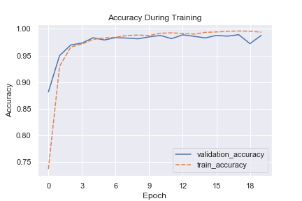
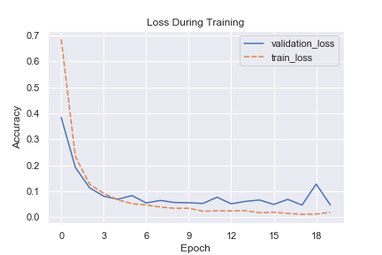
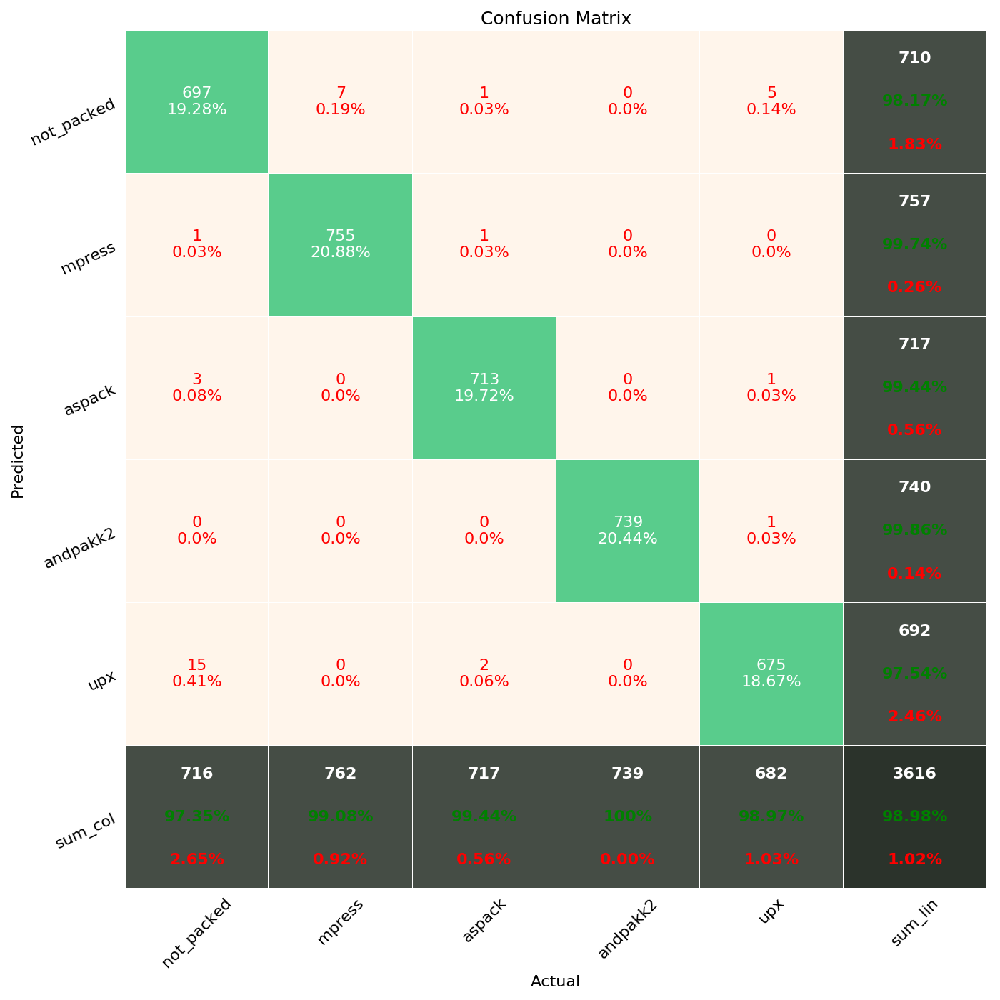

# Packed File Analysis
The goal of this project is to assess the viability of accurately detecting specific file packers using Machine Learning.  The hypothesis is that a neural network architecture will be able to take in a large number of raw bytes from packed files and learn patterns sufficient for accurate classification without the need for manual feature engineering.
 
## Project Structure
There are three main parts to this project.
1. Profiling PE files.
1. Packing PE files.
1. Multi-class Classifier for packed files.

### 1. Profiling PE Files
Implemented in profiler.py.  Takes in a directory containing files and returns basic file triage information similar to the metadata from VirusTotal.
* File Type (output of file command)
* PE metadata (imports, exports, sections, resources, code signing, strings summary)
* Exif metadata
* Yara rule evaluation

The output is written to a file and sent to a local Elasticsearch instance.
```
usage: profiler.py [-h] [-d DIRECTORY] [-f FILE] [-t TEMP_DIRECTORY]
                   [-yr YARA_RULES] [-fd FULL_DETAILS] [-o OUTPUT_DIRECTORY]
                   [-l LABEL]

Parses metadata from files and stores them in log files.

optional arguments:
  -h, --help            show this help message and exit
  -d DIRECTORY, --directory DIRECTORY
                        Directory containing files to analyze.
  -f FILE, --file FILE  Path to a specific file to analyze.
  -t TEMP_DIRECTORY, --temp_directory TEMP_DIRECTORY
                        Where temporary work area is created while processing
                        files if needed (compressed files).
  -yr YARA_RULES, --yara_rules YARA_RULES
                        Path to yara rules to use with analysis.
  -fd FULL_DETAILS, --full_details FULL_DETAILS
                        Full details will include a large nested json object.
  -o OUTPUT_DIRECTORY, --output_directory OUTPUT_DIRECTORY
                        (Optional) Directory to save parsed data to. Default
                        is current directory.
  -l LABEL, --label LABEL
                        (Optional) Tag results with this column and include in
                        output filename.
```

Example:
```
python profiler.py -d "E:\data\packed_malware_gatech\packed_mpress\00000" -t "E:\data\packed_malware_gatech\temp" -o "E:\data\packed_malware_gatech\profiler_data" -l mpress
```

### 2. Packing PE Files
Implemented in packer.py 


### 3. Classifying PE Files
Implemented in build_model.py


## Results
This proof of concept was initially tested with a dataset of 18k labeled files and five classes ("not packed", "mpress", "UPX", "Aspack", and "andpakk2").






